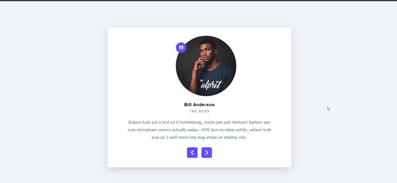

Live Demo - https://incredible-creponne-6f9a0a.netlify.app/

# Reviews App ⭐

A modern React application that lets users browse through different reviews using Previous, Next, and Surprise Me functionality. This project demonstrates React Hooks, state management, event handling, and component-based design.

## Features

- Display reviewer image, name, job title, and description
- Previous and Next navigation
- Random review (Surprise Me)
- Responsive card layout
- Interactive UI with hover effects
- Smooth and modern design

## Tech Stack

- React.js
- JavaScript (ES6+)
- CSS3
- React Icons

## Demo

## Screenshot

## Author

**Charan Sai**
